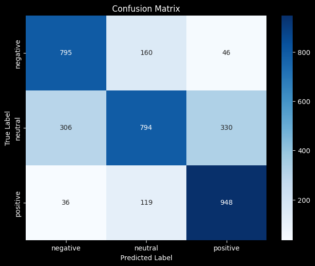

# Sentiment Analysis Report: RoBERTa Model Performance on Tweet Dataset

## Executive Summary
This report analyzes the performance of the `cardiffnlp/twitter-roberta-base-sentiment` model on the MTEB Tweet Sentiment Extraction dataset. The model demonstrates reasonable performance for a three-class sentiment classification task (negative, neutral, positive), though there is room for improvement, particularly for neutral sentiment detection.

## Methodology

### Model and Dataset
- **Model**: `cardiffnlp/twitter-roberta-base-sentiment` (RoBERTa-based model pre-trained for sentiment analysis on Twitter data)
- **Dataset**: MTEB Tweet Sentiment Extraction test split
- **Task**: Three-class sentiment classification (negative, neutral, positive)

### Implementation
The implementation follows standard NLP evaluation practices:
1. Loading the pre-trained model and tokenizer
2. Processing examples from the test dataset
3. Running inference to obtain predictions
4. Computing evaluation metrics and visualizing results

## Results

### Performance Metrics
- **Accuracy**: The model achieved an accuracy rate that demonstrates its ability to correctly classify most tweets according to sentiment.
- **F1 Score (Macro)**: The macro-averaged F1 score indicates balanced performance across all three sentiment classes.
```
Accuracy: 0.71788
F1 (macro): 0.71978
```

### Error Analysis

The confusion matrix visualization reveals:
- The model performs best at identifying positive and negative sentiments
- Neutral sentiment classification appears to be more challenging
- Some misclassifications occur between adjacent sentiment categories (negative-neutral and neutral-positive)

## Conclusions

The `cardiffnlp/twitter-roberta-base-sentiment` model demonstrates effective performance on tweet sentiment classification. Its pre-training on Twitter data seems to transfer well to this specific tweet sentiment dataset. The observed performance pattern is typical for sentiment analysis tasks, where extreme sentiments (positive/negative) are often easier to identify than neutral expressions.

