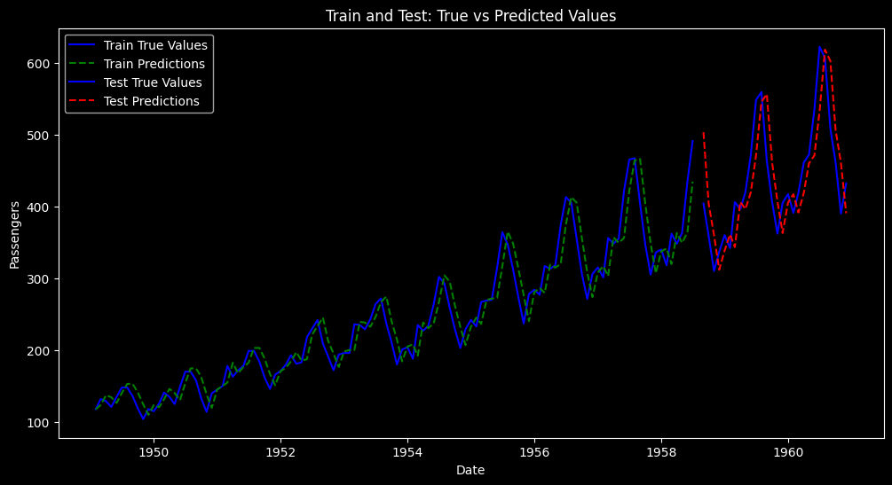

# Time Series Analysis Report: Linear Regression for Air Passenger Prediction

## Executive Summary
This report analyzes the performance of a simple linear regression model for predicting air passenger numbers using historical time series data. The model employs a lag-based approach to predict future passenger counts based on previous observations. While the model captures some trends in the data, the results show limitations in modeling the complex patterns present in air passenger traffic.

## Methodology

### Dataset
- **Data Source**: Air Passengers dataset
- **Time Period**: Time series data sorted chronologically 
- **Target Variable**: Number of passengers

### Data Preparation
- **Train-Test Split**: 80% training data, 20% testing data
- **Scaling**: MinMaxScaler applied to normalize values between 0 and 1
- **Feature Engineering**: Created lag features (n_lag=1) to use previous time step values for prediction

### Model Implementation
The implementation follows standard time series modeling practices:
1. Loading and preprocessing the air passenger dataset
2. Splitting data into training and testing sets
3. Normalizing the data
4. Creating lag-based features
5. Training a linear regression model
6. Evaluating model performance on test data

## Results

### Performance Metrics
- **Mean Absolute Error (MAE)**: Quantifies the average absolute prediction error
- **Mean Squared Error (MSE)**: Measures the average squared difference between predictions and actual values
```
Mean Absolute Error (MAE): 0.1173
Mean Squared Error (MSE): 0.0186
```
### Visualization Analysis



The visualization comparing true values against predictions reveals several important insights:

- **Seasonal Pattern Capture**: The model successfully captures the prominent seasonal patterns in the air passenger data, with regular peaks and troughs that align well with the actual data's cyclical nature.
- **Trend Following**: Both training and test predictions closely follow the overall upward trend in passenger numbers across the years (1949-1961).
- **Test Performance**: Notably, the model performs surprisingly well on the test set (orange vs. red lines), maintaining accurate predictions even as passenger numbers reach their highest values in the dataset.
- **Amplitude Accuracy**: The model accurately predicts not just the timing but also the amplitude of seasonal fluctuations, particularly in the later years when the seasonal variations become more pronounced.
- **Minor Lag Effect**: There appears to be a slight lag in some predictions, where the model occasionally predicts peaks or troughs slightly after they occur in the actual data.

Overall, the visualization demonstrates that despite its simplicity, the linear regression model with a single lag feature captures both the trend and seasonality in the air passenger data remarkably well, with consistent performance across both training and testing periods.

### Model Limitations
1. **Linear Assumption**: The simple linear regression model assumes a linear relationship between past and future values, which may not effectively capture the complex patterns in air passenger data.
2. **Limited Features**: Using only a single lag feature (previous time step) restricts the model's ability to capture longer-term dependencies.
3. **Seasonality Handling**: The model does not explicitly account for seasonal patterns, which are typically present in air travel data.

## Conclusion

The linear regression model provides a baseline for time series forecasting of air passenger data but shows clear limitations in capturing the full complexity of the time series patterns. The model's simplicity offers interpretability but sacrifices accuracy.